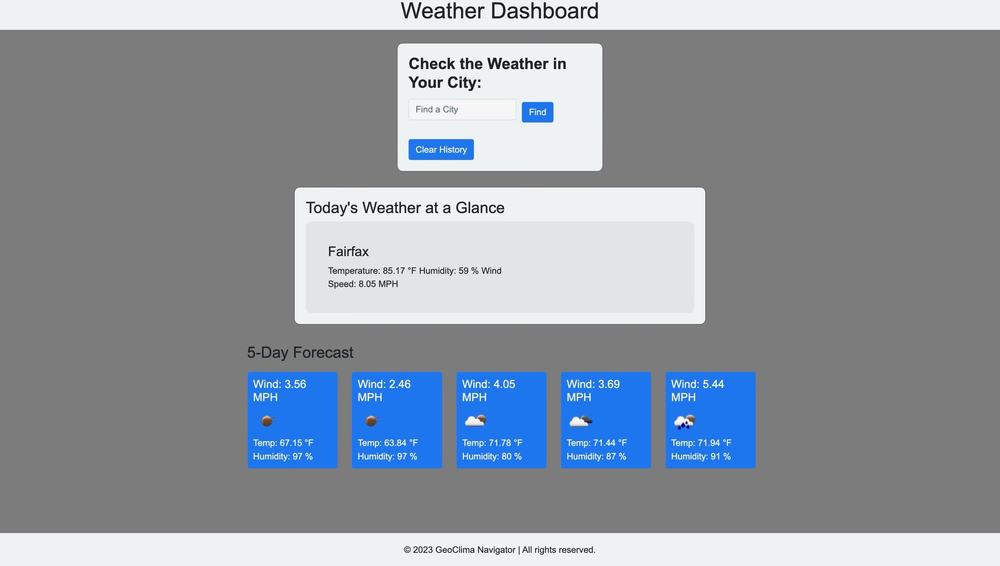

# GeoClima-Navigator-Multicity-Weather-Dashboard

## Description

The GeoClima-Navigator Multicity Weather Dashboard is an interactive, browser-based application that provides weather data for various cities. This application is designed for travelers who want to have a look at the weather conditions in multiple cities to plan their trips accordingly.

The application leverages third-party APIs, specifically the OpenWeather API, to access weather data by making requests with specific parameters to a URL. It provides the current weather condition as well as a 5-day forecast for the searched city, including information such as the city name, date, an icon representing weather conditions, temperature, humidity, and wind speed.

Users can search for a city using a search box. The application then retrieves and displays the current and future weather conditions for that city. Each searched city is also added to the user's search history for easy future reference. The application stores any persistent data, such as the search history, in the browser's local storage. When a city from the search history is clicked, the current and future conditions for that city are displayed again.

The application interface is intuitive, easy to navigate, and visually appealing. The GeoClima-Navigator Multicity Weather Dashboard helps travelers make informed decisions about their trips by providing them with timely and accurate weather data.

## Screenshot

## Link to the Deployed Application

Link to Deployed Application: https://kojootchere.github.io/GeoClima-Navigator-Multicity-Weather-Dashboard/